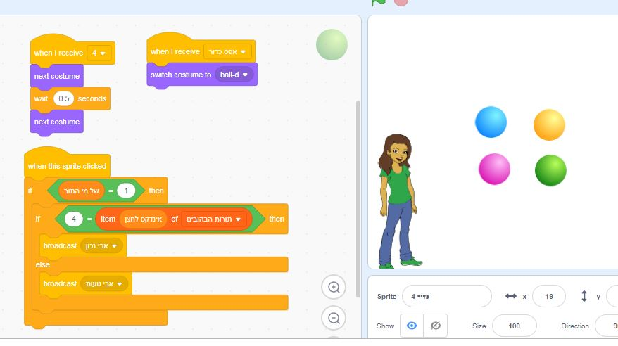

# simon-says
The beloved "Simon says" game on Scratch 3.0

## How to use?

1. Download the file [פרוייקט%20סיימון%20עם%20אבא.sb3](פרוייקט%20סיימון%20עם%20אבא.sb3)
1. Go to https://beta.scratch.mit.edu/
1. Open the file Using `file -> Upload from your computer`.
1. Hit the "Go" button

